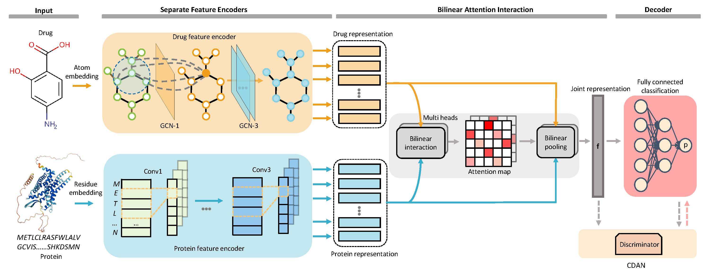

# Interpretable bilinear attention network with domain adaptation improves drug-target prediction | [Paper](https://arxiv.org/abs/2208.02194)

## Introduction
This repository contains the PyTorch implementation of **DrugBAN** framework on drug-target interaction prediction. **DrugBAN** is a deep bilinear attention network (BAN) framework with adversarial domain adaptation to explicitly learn pair-wise local interactions between drugs and targets,
and adapt on out-of-distribution data. It works on two-dimensional (2D) drug molecular graphs and target protein sequences to perform prediction.
## Framework

## System Requirements
The source code developed in Python 3.8 using PyTorch 1.8.1. The required python dependencies are given below. `DrugBAN` is suuported for any standard computer with enough RAM to run.

```
torch>=1.8.1
dgl>=0.7.1
dgllife>=0.2.8
numpy>=1.20.2
scikit-learn>=0.24.2
pandas>=1.2.4
prettytable>=2.2.1
rdkit~=2021.03.2
yacs~=0.1.8
comet-ml>=3.23.1 # optional
```
## Installation Guide
Clone this github repo and set up a new conda environment. It normally takes about 10 minutes to install.
```
# create a new conda environment
$ conda create --name drugban python=3.8
$ conda activate drugban

# install requried python dependencies
$ conda install pytorch==1.8.1 torchvision==0.9.1 torchaudio==0.8.1 cudatoolkit=10.2 -c pytorch
$ conda install -c dglteam dgl-cuda10.2==0.7.1
$ conda install -c conda-forge rdkit==2021.03.2
$ pip install dgllife==0.2.8
$ pip install -U scikit-learn
$ pip install yacs
$ pip install prettytable

# clone the source code of DrugBAN
$ git clone https://github.com/pz-white/DrugBAN.git
$ cd DrugBAN
```


## Datasets
The `datasets` folder contains all experimental data used in DrugBAN: BindingDB, BioSNAP and Human. 
In `datasets/bindingdb` and `datasets/biosnap` folders, we have full data with two random and clustering-based splits for both in-domain and cross-domain experiments.
In `datasets/human` folder, there is full data with random split for the in-domain experiment, and with cold split to alleviate ligand bias.

## Model Training

To train DrugBAN, where we provide the basic configurations for all hyperparameters in `config.py`. For different in-domain and cross-domain tasks, the customized task configurations can be found in respective `configs/*.yaml` files.

For the in-domain experiments with vanilla DrugBAN, you can directly run the following command. `${dataset}` could either be `bindingdb`, `biosnap` and `human`. `${split_task}` could be `random` and `cold`. 
```
$ python main.py --cfg "configs/DrugBAN.yaml" --data ${dataset} --split ${split_task}
```

For the cross-domain experiments with vanilla DrugBAN, you can directly run the following command. `${dataset}` could beither `bindingdb`, `biosnap`.
```
$ python main.py --cfg "configs/DrugBAN_Non_DA.yaml" --data ${dataset} --split "cluster"
```
For the cross-domain experiments with CDAN DrugBAN, you can directly run the following command. `${dataset}` could beither `bindingdb`, `biosnap`.
```
$ python main.py --cfg "configs/DrugBAN_DA.yaml" --data ${dataset} --split "cluster"
```

## Comet ML
[Comet ML](https://www.comet.com/site/) is an online machine learning experimentation platform, which help researchers to track and monitor their ML experiments. We provide Comet ML support to easily monitor training process in our code.
This is **optional to use**. If you want to apply, please follow:

- Sign up [Comet](https://www.comet.com/site/) account and install its package using `pip3 install comet_ml`. 
   
- Save your generated API key into `.comet.config` in your home directory, which can be found in your account setting. The saved file format is as follows:

```
[comet]
api_key=YOUR-API-KEY
```

- Set `_C.COMET.USE` to `True` and change `_C.COMET.WORKSPACE` in `config.py` into the one that you created on Comet.


For more details, please refer the [official documentation](https://www.comet.com/docs/python-sdk/advanced/).

## Citation
Please cite our paper if you find our work useful in your own research.
```
    @article{drugban,
      title   = {Interpretable bilinear attention network with domain adaptation improves drug-target prediction},
      author  = {Peizhen Bai and Filip Miljkovi{\'c} and Bino John and Haiping Lu},
      journal = {arXiv:2208.02194 [cs.LG]},
      year    = {2022}
    }
```